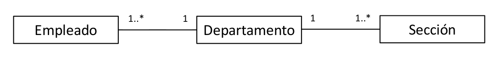
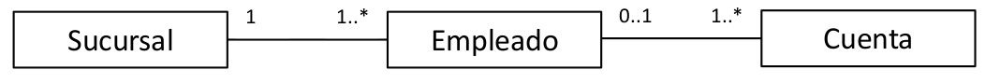

# 2. Modelado de datos: Introdcción al diseño de bases de datos ([PDF](originales/02-modeladoDatos.pdf))
## Etapas del diseño
¿Qué pasos se siguen en el diseño de bases de datos? Existen una serie de diseños que se realizan en un cierto orden.

1. Análisis de requisitos: Comprender los datos a gestionar, elicitar las necesidades del cliente a través de reuniones, discusiones, documentación... Es una etapa clave que puede ser muy costosa.
2. Diseño conceptual: Descripción de alto nivel de los datos y sus restricciones. Modelo que representa, organiza y clarifica la información. Normalmente, modelo Entidad-Relación. Es suficientemente preciso como para permitir su traducción a un modelo específico del SGBD.
3. Diseño lógico: Esquema de la BD acorde al SGBD elegido. Traducción del esquema ER a un esquema relacional.
4. Refinamiento de los esquemas: Reestructuración para garantizar propiedades importantes (normalización).
5. Diseño físico: Mejora de rendimiento en base a cargas típicas. Idealmente no supone un rediseño de las etapas anteriores.
6. Diseño de aplicaciones y seguridad: Procesos relacionados con las aplicaciones, como tareas y flujos de trabajo, y cuestiones de accesibilidad y seguridad.

## Diseño lógico o conceptual primero
Hay que preguntarse cuestiones como, en el caso del sistema de gestión telefónica, si dos clientes pueden tener la misma línea, si una línea puede tener dos tarifas, si son necesarias más tablas y cuáles, etc.

El diseño conceptual se realiza como diagrama ER (Entidad-Relación) con notación UML. Describe cómo se estructuran los datos. Existen varias alternativas para un mismo escenario, y hay que decidir.

Las **entidades** son objetos que engloban los datos de interés. Se describen como colecciones de entidades similares, mediante atributos y propiedades adicionales. Las instancias se ven como elementos de un conjunto.

Los **atributos** y **claves** definen los datos para cada instancia. El **dominio** (opcional) es el conjunto posible de valores o la posibilidad de definición de tipos. La **clave** es el conjunto mínimo de atributos que identifica a cada entidad (valor mínimo sin repetición).

Las **relaciones** representan asociaciones entre dos o más entidades, en función de su grado. También se puede ver como un conjunto de relaciones con instancias de dichas relaciones dependiendo de si hay que modelar también la relación con unas propiedades.

La **cardinalidad** es una multiplicidad simplificada a tres posibles valores: `1:1`, `1:*`, `*:*`. Se puede representar la opcionalidad poniendo el mínimo a cero.

Una relación puede ser **recursiva** si una instancia de una entidad se relaciona con otra instancia de la misma entidad.

Una entidad es **débil, dependiente o subordinada** si se identifica considerando la primary key de otra entidad denominada **propietaria o dominante**. Expresa una relación obligatoria y con dependencia en existencia.

### Trampas de conexión
Relaciones que provocan ambigüedades u ocultan información.

En el caso de _fan traps_, no podemos saber a qué sección pertenece el empleado o cuáles son los empleados de una sección.

En el caso de _chasm traps_, una relación opcional hace que perdamos la referencia a alguna entidad. En este caso, puede haber cuentas que no estén asociadas a ningún empleado y por tanto que no tengan sucursal.

### Generalización y especialización (relación _is-a_)
Se pueden hacer entidades que tengan unas propiedades específicas más las comunes generales heredadas de otra entidad.

### Agregación
Representa la composición o agregación de partes en un todo. Funciona como una asociación con un significado adicional. Si la creación o destrucción coinciden, es una composición. La agregación se representa con un rombo vacío en el 'todo', y la composición con un rombo relleno.

### Elementos del modelado ER
Hay que decidir si modelar un concepto como entidad, como atributo o como relación; identificar si una relación es binaria o ternaria; y ver cuándo hay que usar la agregación.

Para incluir restricciones en el modelo ER, los datos están acompañados de condiciones de validez. Algunas de estas restricciones no se pueden capturar en diagramas ER, así que se incluyen en notas usando lenguajes de restricciones.
