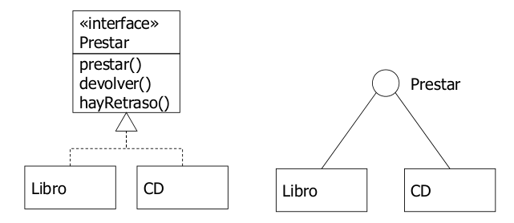
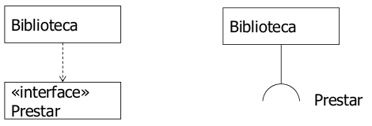
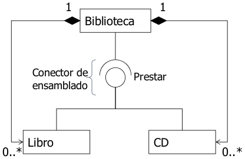
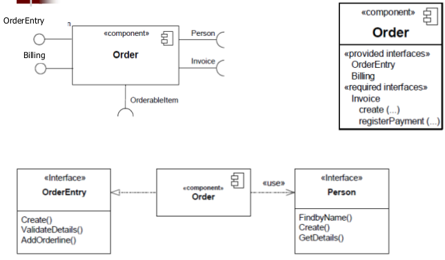
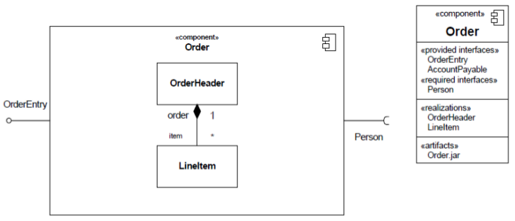
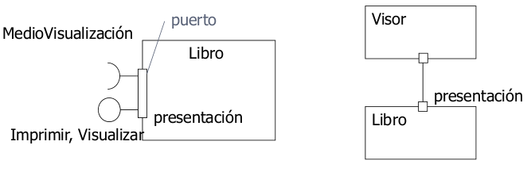
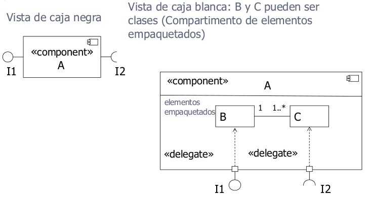
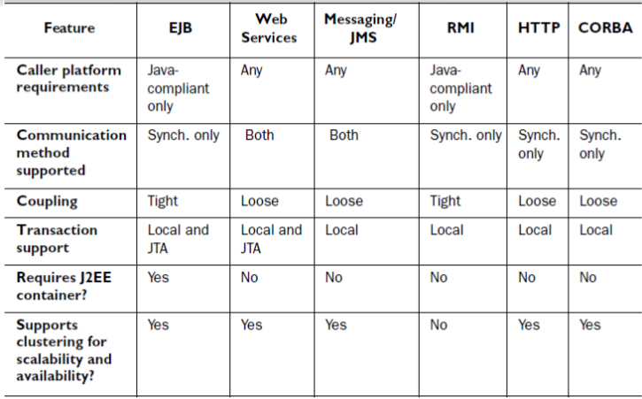

# 4. Ingeniería del Software basada en componentes
## 4.1 Especificación de componentes con UML
Un componente representa una parte modular del un sistema que encapsula su contenido y cuya manifestación es reemplazable dentro de su entorno. Se ve como una caja negra cuyo comportamiento está completamente definido por sus interfaces proporcionadas y requeridas, y puede ser sustituido por otros componentes que proporcionen el mismo protocolo.

Los componentes pueden ser físicos (instanciados directamente en tiempo de ejecución como un EJB) o lógicos (una construcción lógica como un subsistema, que solo se instancia indirectamente al instanciar sus partes).

**Intefaz proporcionada**: la interfaz que implementa el componente. Ofrece sus servicios.

**Interfaz requerida**: indica que el componente utiliza los servicios definidos por la interfaz.

**Conectores de ensamblado**: conexión entre ambos tipos de interfaz.

**Representaciones de caja negra**:

**Representaciones de caja blanca**:

Un **puerto** especifica un punto de interacción entre un clasificador y su entorno. Se describe por sus interfaces proporcionadas y requeridas. Es un conjunto semánticamente cohesivo de interfaces, y puede tener un nombre.

### Estructura interna
Internamente, un componente puede realizarse con clases o descomponerse en otros componentes. Las interfaces delegan en las partes internas, pudiendo mostrar los elementos anidados, conectados a él por relaciones de dependencia.

Se pueden mostrar clases que realizan el componente (compartimento de elementos empaquetados) o componentes internos (compartimento de estructura interna) con sus partes y conectores.

<!-- TODO Completar desde diapo 13 -->

### 4.1.1 Partición: subsistemas como componentes
El sistema se divide en subsistemas, que se dividen en módulos, que se dividen en sucesivos niveles de componentes que finalmente se implementan con clases y objetos.

Un **subsistema** es un componente que actúa como unidad de descomposición de un sistema para dividirlo en porciones manejables. Es un paquete UML. Se agrupan en el mismo subsistema las clases o componentes que se encuentrar en el mismo área de interés, pertenecen a la misma jerarquía, comparten casos de uso o están asociadas fuertemente.

No se puede instanciar un subsistema en tiempo de ejecución pero sí se pueden instanciar sus partes contenidas, y conectarse a otros subsistemas a través de interfaces para crear una arquitectura.

Una **arquitectura física** está formada por subsistemas e interfaces, con los subsistemas organizados según el patrón arquitectónico de capas. Cada capa contiene subsistemas de diseño: capa de presentación, de dominio, de servicios, de utilidades, etc. Las dependencias entre capas se definen cuidadosamente, van en una sola dirección y siempre a través de interfaces.

Es conveniente dividr el modelo que representa todo el dominio. Por ello, organizamos un paquete con los elementos comunes como subsistema y el resto de paquetes como subsistemas. <!-- TODO No está muy claro -->

La interfaz de usuario se comunica con un controlador de fachada, aplicando el patrón fachada. Para aplicar este patrón, se identifican las partes cohesivas del sistema, se empaquetan en un subsistema y se define una interfaz para interactura con ese subsistema. Las dependencias entre subsistemas se pueden implementar con conectores.

## 4.2 Diseño de componentes con JEE
En JSP se usa MVC, con JavaBean como modelo.

En JEE se diseñan los componentes en varias capas. Se parte de la especificación de los componentes en UML. Después se diseñan éstos en capas, se diseña la arquitectura de red, se programan y se realizan las pruebas unitarias.

En JEE existen las siguientes capas:

- Capa de presentación: controla lo que se muestra al usuario final.
- Capa de despliegue: publica las operaciones de las clases de dominio.
- Capa de dominio: procesa la lógica y las reglas de negocio a través de clases de dominio u objetos de negocio. Junto con la capa de despliegue, implementa la lógica de negocio.
- Capa de acceso a datos: gestiona la lectura, escritura, actualización y borrado de los datos almacenados. Podría funcionar con JDBC/JPA pero también con XML o ficheros.
- Capa de componentes arquitectónicos: componentes genéricos que pueden usarse en todas las capas.
- Capa de objetos de transferencia de datos: estructuras de información ligeras (DTOs) relacionadas con las clases de dominio usadas para compartir información a través de las capas.

### Capa de acceso a datos
Se implementa mediante clases de tipo Data Access Objects (DAO) u otro patrón equivalente. Gestiona el acceso al almacenamiento persistente independientemente del tipo que sea. El acceso a datos independiente permite cambiar las fuentes de datos y compartir el acceso a datos entre distintas aplicaciones.

### Lógica de negocio
#### Capa de dominio
Proviene de las clases del dominio y las reglas de negocio. Las clases de dominio deberían estar separadas de las capas DAO y de despliegue para maximizar sus posibilidades de reutilización.

Suele utilizar y coordinar varios DAOs. Suele usar patrones como adaptador, compuesto, estrategia, etc.

#### Capa de despliegue
Es específica de la arquitectura JEE. Incluye los EJBs de mensaje y sesión y/o los servicios web necesarios. Se puede tener un servicio web y un EJB para la misma capa de dominio.

##### Tipos de despliegue

Si la clase de dominio se usa por páginas HTML dinámicas, servlets o JSP, se pueden aislar con algún tipo de despliegue en lugar de ser utilizados directamente por la capa de presentación. Suele implementarse con un **EJB de sesión**.

Si la clase de dominio requiere soporte de transacciones (requiere JTA, proporcionado por contenedores JEE), se puede implementar con un **EJB de sesión "stateful"**.

Si la clase de dominio recibe y procesa mensajes JMS, se implementa con un **EJB de mensaje**.

Si la clase de domino es invocada desde aplicaciones no Java, se puede implementar como **servicio web**.

### Capa de presentación
Es la sección de la aplicación responsable de todo lo que los usuarios finales ven físicamente en la interfaz de usuario. JEE soporta interfaces HTML/Javascript, y produce interfaces HTML usando una combinación de páginas HTML estáticas y dinámicas, generadas por sevlets y JSP. Puede estar en una máquina distinta del contenedor JEE (interfaz remota).

### Capas auxiliares
Capas de objetos de transferencia de datos (data transfer objects). Son estructuras de datos útiles. En UML se indican con el estereotipo `<<DataType>>`. Se conoce como patron DTO.

Capa de componentes arquitectónicos: componentes de terceros, utilidades comunes, etc.

### Diseño en capas
### Proceso de desarrollo: tareas de diseño
Fases previas:

- Casos de uso y modelo de dominio.
- Diagramas de secuencia y máquinas de estado.

Capas y clases de diseño de cada componente (arqitectura estándar JEE): de cada clase del dominio se derivan varias, una por cada capa (...Manager, ..., ...DAO, ...DTO). Se utilizan interfaces, especialmente para los EJB. Los métodos derivan de las operaciones del dominio y se incorporan a todas o parte de las clases de diseño.

<!-- TODO Pistas diapo 57 -->

### Arquitectura de la red
El arquitecto es responsable de asegurarse de que las aplicaciones cumplan con la infraestructura de seguridad de la empresa, de la escalabilidad (capacidad de la aplicación de manejar un número cada vez mayor de usuarios) y de la disponibilidad (una aplicación con alta disponibilidad es aquella que está siempre disponible para su uso y tiene un mínimo tiempo de inactividad) de las aplicaciones.

### Seguridad
En la mayoría de las empresas, la seguridad está centralizada y se trata como una cuestión de infraestructura. Por tanto, hay que aprovechar la infraestructura de seguridad tanto como sea posible, y hay ue auditar el uso de identificadores genéricos por problemas de acceso a la base de datos.

## 4.3 Diseño de las capas
### 4.3.1 Patrón DTO
Con este patrón se diseña una de las capas transversales de la arquitectura. Resuelve el problema de cómo permitir a un cliente intercambiar datos con el servidor sin hacer múltiples llamadas de red de grano fino preguntando por cada dato.

DTO lo resuelve transfiriendo un objeto ligero al cliente con todos los datos necesarios. Después, el cliente  puede hacer peticiones locales al objeto que ha recibido.

Para ello, se crean clases Java que encapsulan los datos en un paquete transportable por la red (implementan `java.io.Serializable`).

Una clase DTO es una clase ligera que representa una estructura de datos (`<<datatype>>` en UML) e implementa `java.io.Serializable`. Se usa en todas las capas de la aplicación. Se elige esta solución por resolver el problema de eficiencia descrito anteriormente.

Es recomendable rellenar siempre todos los campos del DTO para evitar errores `NullPointerException` (puede ser mejor una cadena vacía), hacer que los DTOs sean autodescriptivos, usar arrays o colecciones de DTOs cuando sea necesario, y considerar métodos que redefinan `equals()`.

Hay dos variantes. Podemos usar DTOs personalizados que representan parte de un bean o agrupan varios beans, o bien podemos usar DTOs de dominio denominados "entities". Al usar patrón fachada, una clase de dominio no es accesible directamente por el cliente. Por esa razón, se hacen copias DTO de los objetos de dominio del servidor (entities). Los clientes pueden operar sobre copias locales mejorando el rendimiento de las lecturas y actualizaciones.

### 4.3.2 Patrones de la capa de acceso a datos
Hay varias opciones. Se puede usar el patrón Active Record y eliminar la capa de acceso a datos pues la clase de dominio maneja directamente el acceso a datos.

Sin embargo, conviene separar el acceso a datos en un paquete independiente. Lo más común es hacerlo a través del patrón DAO o del patrón Mapper.

#### Patrón DAO
Requiere un `DataSource` que representa una base de datos, XML, archivo, etc y un `ResultSet` que es la respuesta del `DataSource`. El DAO manipula el resultado para devolver un DTO serializable.

#### Patrón DAO/JPA o Entity Access Objects (EAO)
Con este patrón, el DTO es una clase tipo `Entity` JPA. La interfaz del EAO proporciona los métodos para crear, buscar, borrar, etc.

#### Patrón fachada de acceso a datos
Una clase `Entity` es un POJO, no un EJB. Se usa un EJB como fachada para acceder a la instancia de la clase entity desde las capas de dominio o despliegue.

#### Automatización con NetBeans
NetBeans permite automatizar el patrón DAO. Genera la clase `@Entity` y un EJB de sesión con su interfaz básica CRUD de acceso a datos que actúan como fachada de acceso a datos.

La alternativa es usar el **patrón Mapper OR** (Objeto-Relacional). Es una opción que ofrece una traducción más directa entre objetos y almacenamiento relacional. Permite que el EJB devuelva instancias de clases del dominio, invirtiendo la dependencia.

La interfaz del mapper nos proporciona los métodos CRUD, haciendo que la clase del dominio no sea un EJB sino un POJO.

### 4.3.3 Patrones de la capa de negocio
#### Despliegue: Patrón fachada de sesión
Los EJB de sesión pueden ser utilizados desde distintos clientes (servlets, aplicaciones cliente servidor de escritorio, etc), reduciendo el acoplamiento. <!-- TODO Diapo 93 -->

En la capa de despliegue se implementa el patrón fachada de sesión, que es la interfaz para los clientes que conecta con la capa de dominio.

Este patrón resuelve el problema de que un EJB ejecute todas las llamadas involucradas en un caso de uso a partir de una única petición de red desde el cliente. Esta fachada se implementa con un Session EJB.

Otra alternativa es usar el patrón comando EJB, que implementa una solución más ligera y suele usarse en frameworks. En este caso, se crea una clase que representa un comando. A través de llamadas desde el servlet a una instancia de esa clase se configura el comando para después ordenar que se ejecute y una vez ejecutado, obtener los resultados.

#### Dominio: Patrones Domain Model y Transaction Script
Si necesito una transacción que involucra a varias clases, como la creación de un pedido con líneas de detalle, la lógica no puede limitarse a una única clase/EJB.

En la capa de dominio se usan los patrones Domain Model o Transaction Script.

Domain Model reparte el modelo de análisis entre la capa de despliegue (EJBs fachada de sesión) y la capa de dominio (clases del dominio). Es más adecuado para clases con un comportamiento complejo. Refleja directamente el modelo de análisis (las clases de análisis y los diagramas de secuencia).

Transaction Script es más adecuado para clases con un comportamiento muy sencillo. El comportamiento se traslada a los EJB de sesión y la capa de dominio se integra en la de despliegue.

<!-- TODO Diapo 107 -->

### Patrones de las capas de persistencia, negocio y presentación
## 4.4 CBSE: Desarrollo para y con reutilización
## 4.5 Diseño basado en componentes
## 4.6 Despliegue de componentes
