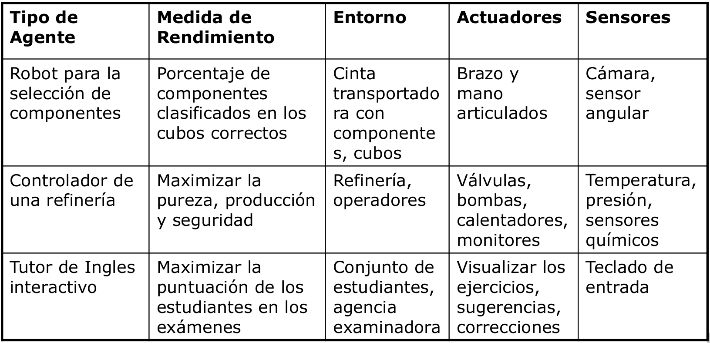

# 0. Introducción ([PDF](originales/introduccion.pdf))
## 0.1. Caracterización y perspectiva de agente
### 0.1.1. Caracterización
La IA se refiere al diseño y análisis de agentes autónomos. Son sistemas software o máquinas físicas con sensores y actuadores. Un **sistema inteligente** tiene que percibir su entorno, actuar racionalmente hacia sus tareas preasignadas, interaccionar con otros agentes y con seres humanos.

### 0.1.2 ¿Qué es un sistema inteligente?
Un sistema inteligente es un agente inteligente o, mejor dicho, racional. Se verá más adelante.

### 0.1.3 Concepto de agente
Entidad que percibe su entorno a través de sensores y modifica el entorno mediante actuadores. El típico ejemplo del termostato.

### 0.1.4 Comportamiento de un agente
Teóricamente la **función de agente**, que consiste en, dada una secuencia de percepciones, ejecutar una serie de acciones.

### 0.1.5 Mundo del aspirador
Fila de dos casillas. El agente detecta su situación y si la casilla en la que está está sucia. Sus posibles acciones son derecha, izquierda, asiparar y noop. Su función de agente es: si la casilla actual está sucia, aspirar. Si no, ir a la otra casilla.

Tenemos pues secuencias de percepciones, acciones y una función de agente que las relaciona, pero también tenemos un entorno. El entorno puede ser:

- Discreto o continuo.
- Estático (No cambia mientras el agente delibera) o dinámico.
- Determinista (Las acciones siempre funcionan como se espera) o estocástico.
- Uniagente o multiagente.
- Episódico (La calidad de las acciones no depende de las decisiones previas) o secuencial.
- Parcial o totalmente observable.

El mundo del aspirador es de cada una de estas opciones la más sencilla excepto en el último caso, puesto que el mundo es parcialmente observable.

### 0.1.6 ¿Cómo determinar la calidad de un agente?
Hay que definir una medida del rendimiento que cuantifique el grado de éxito, que sea objetiva y externa, es decir, desde el punto de vista del entorno.

Para el mundo del aspirador, se podrían definir las siguientes:

- Suciedad aspirada en un turno de 8 horas.
- Tiempo total en que el suelo está limpio.
- Suelo limpio sin demasiado consumo eléctrico.

Cada una tiene sus pegas, hay muchas variables que intervienen y que queremos optimizar.

### 0.1.7 Agente racional
Según Rusell y Norvig:

> Aquél que para cada posible secuencia de percepciones, realiza la acción que se espera que maximice su medida de rendimiento, basándose en la evidencia proporcionada por su secuencia de percepción y el conocimiento que el agente mantiene almacenado.

¿El agente aspirador es racional? Depende. Supone que:

- el entorno tiene una geometría conocida y una distribución inicial de suciedad desconocida,
- aspirar limpia una casilla y ésta permanece limpia,
- derecha e izquierda mueven al agente a la derecha y a la izquierda sin errores, salvo si le sacan del entorno, que permanece en su casilla,
- la percepción de situación y suciedad siempre es correcta,
- tiene cuatro acciones perfectamente definidas (aspirar, dcha, izda, noop),
- función de agente descrita anteriormente,
- rendimiento medido como 10 puntos por casilla limpia por instante de tiempo.

En ese caso **sí es racional** porque **ningún otro agente obtendrá un mejor rendimiento esperado**. Si el comportamiento parece defectuoso se puede definir otra medida de rendimiento, por ejemplo, suponer que no queremos al agente moviédose en un entorno limpio. Añadimos a la medida de rendimiento una penalización de 1 punto por cada movimiento.

Para maximizar el rendimiento, añadimos a la función de agente que si la secuencia de percepciones incluye ambas casillas limpias, la acción será `noop`.

### 0.1.8 _Racionalidad_ no es perfección y requiere aprendizaje
Un comportamiento perfecto requiere saber por adelantado el resultado de las acciones del agente: solo se pide maximizar el rendimiento esperado.

Excepto para entornos sencillos e invariables, el conocimiento inicial del agente no puede garantizar maximizar el rendimiento a largo plazo.

La racionalidad normalmente requiere aprendizaje para proporcionar autonomía al agente.

### 0.1.9 Ejemplos de agentes y descripción REAS (Medida de Rendimiento, Entorno, Actuadores y Sensores)


### 0.1.10 Estructura de agente
La función de agente no se implementa, pues no se suele conocer. Se **implementa el programa de agente**, que usa solo la percepción actual del entorno y el conocimiento y memoria que pueda tener para seleccionar la acción actual.

Un agente es una **entidad que percibe su entorno a través de sensores y lo modifica mediante actuadores**.

La mayor parte de los principios subyacentes a los sistemas inteligentes se pueden describir con 5 tipos básicos de programas de agente:

- Agente reactivo simple
- Agente reactivo basado en modelos
- Agente basado en metas
- Agente basado en utilidad
- Agentes que aprenden

#### 0.1.10.1 Agente reactivo simple
La entrada de los sensores se usa en una descripción del mundo contenida en el agente, que decide la acción a tomar a través de reglas condición/acción.

Un agente de este tipo es suficiente si la acción actual se puede tomar a partir de la percepción actual. Es útil para muchas tareas de clasificación como por ejemplo:

- Riesgo crediticio.
- Etiquetado de imágenes.
- Comportamiento anómalo en aeropuertos.
- Sistemas sencillos de diagnosis de fallos, etc.

Sin embargo, el agente reactivo simple es muy limitado. No es útil en entornos no totalmente observables y secuenciales. Un agente reactivo simple no puede ser racional con la función de rendimiento definida para el mundo del aspirador (10 puntos por casilla limpia por instante de tiempo, -1 punto por cada movimiento).

#### 0.1.10.2 Agente reactivo basado en modelos
Añade estado, evolución del mundo y efecto de las acciones a la descripción del mundo del modelo de agente reactivo simple.

Puede generar comportamiento racional en numerosas tareas analíticas.

Sistemas basados en conocimiento para tareas analíticas:

- Clasificación.
- Evaluación (Assessment).
- Monitorización.
- Diagnosis.

También tiene limitaciones. A veces, el agente necesita considerar su meta actual para seleccionar la mejor acción. Por ejemplo, el aspirador en un edificio docente tendría dos metas: limpieza y silencio. Habría que fomentar el silencio en horas de docencia y la limpieza fuera de dicho horario.

#### 0.1.10.3 Agente basado en metas / objetivos
Entre la descripción del mundo y la acción, el agente analiza el efecto de realizar una acción teniendo en cuenta la evolución del mundo y el efecto de sus acciones para determinar la acción a tomar. Normalmente el agente considera secuencias de acciones.

Se usa en problemas de búsqueda (rutas, juegos, etc) o en problemas de planificación (horarios de clase, asignación de tiempos a tareas o scheduling, etc).

Sus limitaciones radican en que hay algunas metas que se contradicen y el agente tendría que razonar sobre ellas (como en el ejemplo del aspirador en el centro educativo). También está limitado cuando hay incertidumbre sobre la obtención de las metas, como por ejemplo en un juego de póker.

#### 0.1.10.4 Agente basado en utilidad

#### 0.1.10.5 Agentes que aprenden


## 0.2. Paradigmas principales
### 0.2.1 Sistemas Inteligentes basados en conocimiento (Sistema experto)
No son solo técnicas de búsqueda, sino que incluyen conocimiento, implícito o explícito, sobre el problema a resolver. Son de interés en numerosos entornos como juegos, optimización de rutas, etc.

Los sistemas expertos identifican y explotan el conocimiento humano para la resolución de problemas. Se basan en unas suposiciones básicas:

- El conocimiento proviene de la experiencia.
- Los expertos codifican el conocimiento mediante asociaciones (heurística).
- El conocimiento se puede extraer del experto y codificar mediante un Lenguaje de Representación de Conocimiento.

El conocimiento se codifica con **reglas de producción** que tienen la estructura ```SI antecedente ENTONCES consecuente```. Un ejemplo sería:

```
SI las diferencias de temperatura son anormalmente altas Y las presiones se mantienen aproximadamente constantes ENTONCES sospechar fallo en sensores de temperatura
```

Un ejemplo de sistema experto es _MYCIN_, que tomaba decisiones de diagnosis y terapia de enfermedades infecciosas. Su base de conocimiento estaba compuesta de reglas de producción como la siguiente:

```
if	(1) the stain of the organism is gram-negative
	(2) the morphology of the organisms is coccus
	(3) the growth configuration of the organism is chains
then there is a suggestive evidence (0.7)
	that the identity of the organisms is streptococcus
```

Control: encadenamiento hacia atrás, meta-reglas <!--TODO explicar esto-->

Razonamiento aproximado con factores de certeza. No daba respuestas absolutas, sino probabilidades.

Los sistemas expertos tienen numerosos dominios de aplicación: medicina, mecánica, electrónica, control de procesos, aeronáutica, etc. Existen numerosas tareas basadas en el conocimiento como la diagnosis, configuración, clasificación y otras.

Existen numerosos sistemas expertos. Los más representativos son _MYCIN_, _INTERNIST_ o _R1/XCONF_.

La aproximación de los sistemas expertos está bien establecida a través de una serie de metodologías (ingeniería del conocimiento, ontologías) y sistemas. Esta aproximación será adecuada si hay suficiente experiencia, si no hay otras fuentes de conocimiento, si hay suficientes observaciones y si el sistema permanece estable.

También existen algunos inconvenientes. Sobre la experiencia, puede que sea difícil extraer el conocimiento, disponer de experiencia o expertos, y además existe dependencia del dispositivo <!--TODO no entiendo eso último-->. Sobre el método de solución, pueden darse situaciones nuevas no previstas, puede que se combinen soluciones (por ejemplo, a la hora de encontrar la causa de un fallo múltiple), y el sistema puede ser frágil. También es costosa la obtención del conocimiento, la reutilización del mismo y el mantenimiento de la consistencia de la base de conocimiento; problemas que hay que resolver desde la ingeniería de software.

### 0.2.2 Razonamiento basado en casos
Un caso es la descripción de un problema y su solución. Bajo este concepto, para solucionar un problema nuevo hay que buscar los casos con descripciones similares, adaptar las soluciones revisando el resultado, y almacenar el nuevo caso generado si el resultado es interesante.

Este proceso, denominado **ciclo CBR** (case-based reasoning) se formaliza de la siguiente manera: Partimos de un problema, y lo primero es la fase de recuperación (retrieve) de los casos más parecidos. Después, reutilizamos (reuse) las soluciones de los casos recuperados para tratar de resolver el problema. Seguimos revisando (revise) la solución propuesta hasta dar con una correcta, que almacenamos (retain) como un nuevo caso.

Ventajas:

- No requiere representación explícita del conocimiento.
- Tiene capacidad de aprendizaje.
- Es adecuado si no se dispone de un modelo explícito.

Inconvenientes:

- Son necesarios casos previos.
- La etapa de revisión (revise) tiene limitaciones.

### 0.2.3 Aprendizaje y minería de datos
Permiten inferir conocimiento nuevo ya sea describiendo conceptos a partir de ejemplos etiquetados (clasificación), descubriendo conceptos a partir de ejemplos no etiquetados (clustering), descubriendo regularidades en los datos o mejorando la eficiencia<!--TODO Mejorando la eficiencia de qué-->.

Ventajas:

- Permiten generar automáticamente conocimiento a partir de datos.
- Es adecuado si no dispone de modelo explícito.

Inconvenientes:

- Es necesario disponer de datos suficientes.
- Suele ser de utilidad solo en alguna parte del proceso de solución.

### 0.2.4 Razonamiento basado en modelos
Se tiene un modelo que predice el comportamiento del sistema real. Esta predición se compara con el comportamiento observado y deseado y con las diferencias se genera una solución.

El conocimiento se codifica en modelos (estructura y comportamiento) de los componentes del sistema. El razonamiento se traduce en el proceso de manipulación de los modelos hasta obtener la solución del problema.

Ventajas:

- Es independiente de la experiencia, y por tanto aplicable a dispositivos nuevos. <!-- TODO A qué se refiere con dispositivos? Lo pone en más sitios -->
- Independencia del dispositivo (Problema de las variantes<!-- TODO what-->).
- Soluciones complejas (Por ejemplo, fallos múltiples). <!-- TODO No lo entiendo -->
- Sólido y completo respecto a los modelos.
- Mantenimiento y reutilización del conocimiento a través de bibliotecas de modelos que están disponibles desde el diseño.

Inconvenientes:

- Dificultad de obtención de los modelos. Hay procesos que son poco conocidos, sistemas con demasiados componentes, comportamientos complejos como dinámica, no linealidades, modelos con un rango de validez, etc.
- Existe una mayor carga computacional del proceso de razonamiento, lo que limita esta técnica en aplicaciones en tiempo real.

Áreas de aplicación:

- Planificación y scheduling.
- Configuración y diseño.
- Diagnosis.
- Control.
- Visión.
- Tecnologías del habla.
- Robótica.
- Lenguaje natural.
- Análisis de transacciones.
- Industria informática actual: navegadores, buscadores, gestor e-mail, reconocimiento de matrículas en aparcamientos, compras on-line...

En la industria del automóvil es de gran interés en cuestiones de seguridad, medio ambiente y economía. Hay proyectos de diagnosis a bordo o en el taller, de elaboración de manuales o de diagnosis y mantenimiento preventivo.

En la industria aeroespacial se usa en sistemas de monitorización de las funciones básicas de las naves espaciales (Health Management Systems) como los subsistemas de propulsión, de guiado, de sostenimiento de vida, etc. También para detección, localización y reconfiguración de satélites o lanzaderas por parte de múltiples agencias espaciales y empresas privadas.

Muy útil también en la supervisión de procesos industriales, aportando una atención continuada, seguridad y una calidad homogénea.
