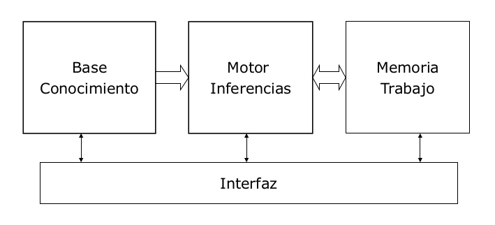

# Representación del conocimiento: Introducción
## Sistemas basados en conocimiento
Son sistemas con una representación explícita y simbólica del conocimiento para resolver un problema. Además, el comportamiento del sistema debe ser consecuencia del contenido de la base del conocimiento. Si usan conocimiento experto, se denominan sistemas expertos.

Un sistema basado en conocimiento es un sistema informático con, al menos, dos componentes estructurales:

- Base de conocimiento: representación explícita y natural del conocimiento del sistema.
- Motor de inferencias: componente de control responsable de utilizar el conocimiento para la solución del problema.

Otros componentes habituales son un editor de conocimiento o un módulo de explicación.

## Tipos de conocimiento
Se dividen según criterios o dimensiones de análisis en biológico, límites de aplicación, niveles o contenidos.

### Biológico

- Fisiológico
	- Necesario para sobrevivir en el medio.
	- Somatizado, sistema nervioso.
	- Reaccionar a estímulos, constantes vitales...
- Automatismos
	- Consecuencia de la interacción con el medio.
	- Requiere aprendizaje.
	- Comunicación, equilibrio, reflejos...
- Cortical
	- Necesidad de comprender y explicar, curiosidad.
	- Gran cantidad de aprendizaje y asimilación de experiencia pasada.
	- Elemento característico: lenguaja hablado y escrito.

### Límites de aplicación
#### Dependiente del dominio
Es el conocimiento necesario para resolver un problema concreto y no es extrapolable a otro tipo de problemas.

Incluye datos, hechos, relaciones, criterios de decisión...

Un ejemplo es la diagnosis de enfermedades pulmonares:
	- Datos: capacidad pulmonar total, capacidad vital forzada, volumen residual...
	- Síntomas: obstrucción moderada de las vías respiratorias.
	- Diagnóstico: asma.
	- Establece relaciones entre ellos.

#### Independiente del dominio
Componentes del conocimiento que tienen que ver con la representación, uso y modificación del conocimiento con independencia del contenido del mismo. Es aplicable a clases de problemas.

Podría resumirse en que si no hay suficientes datos para establecer un diagnóstico, sigue acumulando datos para llegar a una solución.

### Niveles

## Tipos de representación
## Lenguajes de representación de conocimiento
