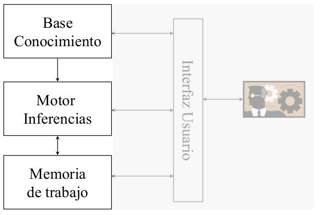

# Representación de conocimiento: Sistemas Basados en Reglas (SBR) ([PDF](originales/representacion_conocimiento/SBR_Completo.pdf))
## 1. Introducción
Los **sistemas basados en reglas** o **sistemas de producción** se caracterizan por utilizar una única estructura para representar el conocimiento: la **regla**.

El esquema de la regla está compuesto por dos partes que se pueden denominar de distinta manera:

- condición -> acción
- antecedente -> consecuente
- lado izquierdo -> lado derecho (LHS -> RHS)
- si ... entonces ...

El interés por este tipo de sistemas radica en que es un formalismo adecuado para representar conocimiento heurístico a través de asociaciones entre los elementos del antecedente y del consecuente. Existen numerosos dominios (parcialmente) gobernados por reglas deterministas.

Es un acercamiento popular por su sencillez, ya que usa una única estructura, y por su eficiencia, pues sus mecanismos deductivos son computacionalmente más eficientes que los de la lógica.

## 2. Componentes de un sistema de producción


- Base de conocimiento (BC o KB).
	- Base de reglas (BR): conjunto de reglas de producción.
	- Declaración de dominio: declaración de los elementos básicos que se referencian en hechos y reglas.
- Memoria de trabajo (MT o WM). Conjunto de hechos. Información que se considera cierta.
- Motor de inferencias (MI o IE). Genera nuevos hechos a partir de la memoria de trabajo usando la base de reglas.

## 3. Lenguajes
Los elementos básicos de la representación son los **hechos**, que representan información que se posee relevante a una instancia o problema concreto, y las **reglas**, que es el conocimiento sobre el dominio del problema que permite derivar hechos adicionales.

Existen variantes de los lenguajes según cómo se referencien los elementos del dominio (tripletes objeto-atributo-valor, patrones simbólicos, etc), según el funcionamiento del motor de inferencias (encadenamiento hacia adelante o hacia atrás) o según otras variables como la incertidumbre, el metaconocimiento, etc.

### Lenguaje objeto-atributo-valor
El universo se conceptualiza en tripletes objeto, atributo y valor. El objeto representa aquello de lo que queremos hablar, el atributo una propiedad del objeto, y el valor es el valor de dicha propiedad. En un hecho, se establece el valor del atributo de un objeto. En una regla, se usan para derivar nuevo conocimiento.

### Declaración de dominio
Se puede dar un conunto definido de objetos (**declaración de objetos**) y una **declaración de atributos** (DA) que puede ser univaluada o multivaluada según si ese atributo puede tener más de un valor a la vez, y tipada o no tipada según si los valores que puede tomar son los que forman parte de un conjunto definido.

Univaluada		| Multivaluada |  /
 -------------------	| ------------------- | --------------
 $O_i . a_j^s:\tau$	| $O_i . a_j^m:2^\tau$ | Tipada
$O_i . a_j^s$		| $O_i . a_j^m$ | No tipada

A partir de la declaración de objetos (O) y de la declaración de atributos (DA), la **declaración de dominio** es $DD = O \cup DA$

Ejemplo de declaración de dominio:

$O=\lbrace paciente-1\rbrace$

$DA = \lbrace paciente-1.sexo^s: \lbrace varón, hembra \rbrace, paciente-1.edad^s: int, paciente-1.síntoma^m, ... \rbrace$

$DD = O \cup DA$

### Hechos en objeto-atributo-valor
Univaluado: $O_i.a=c, si x^s:\tau, c \epsilon \tau$

Multivaluado: $O_i.a=C, si x^m:2^\tau, C \epsilon \tau$

Ejemplos:

$paciente-1.sexo=varón$

$paciente-1.edad=25$

$paciente-1.síntoma={dolorPecho, calambresPiernas}$

### Memoria de trabajo
La **memoria de trabajo** se considera formalmente como un conjunto (sin elementos repetidos, orden irrelevante) que contiene los hechos.

Ejemplo: $H = \lbrace paciente-1.sexo = varón, paciente-1.edad=25, paciente-1.sintoma=\lbrace dolorPecho, calambresPiernas \rbrace, ... \rbrace$


### Reglas en objeto-atributo-valor


Una regla en lenguaje natural podría ser:

```
Si el paciente tiene un dolor abdominal y
	en la auscultación se percibe un rumor abdominal y
	se siente una masa pulsante en el abdomen
entonces el paciente tiene un aneurisma aórtico.
```

Una regla de producción equivalente sería:

```
if iguales(paciente-1, síntoma, dolorAbdominal) and
	iguales(paciente-1, evidencia, rumorAbdominal) and
	iguales(paciente-1, evidencia, masaPulsante)
then añadir (paciente-1, enfermedad, aneurismaAortico)
fi
```

### Condiciones
Las **condiciones** se construyen con un predicado y sus argumentos: objeto, atributo y constante. Por ejemplo, `iguales(paciente, edad, 60)`.

Expresa una comparación (según el predicado) entre la constante especificada y el valor asociado al atributo del objeto en la memoria de trabajo.

Un predicado es una función booleana. Si tenemos el hecho `paciente.edad = 50`, el predicado `iguales(paciente, edad, 60)` evaluará a falso.

El antecedente de una regla (`if ...`) se satisface (`then ...`) si dicho antecedente evalúa a cierto.

### Semántica de los predicados
La interpretación de los predicados en un sistema de producción es **operacional**.

`iguales(o, a, c)` es cierto si existe algún hecho `o.a = c` en la memoria de trabajo. El comportamiento depende del motor de inferencias: si es hacia adelante, solo se consulta el contenido actual de memoria de trabajo; si es hacia atrás, puede forzar la búsqueda del hecho.

A diferencia con la lógica, el predicado solo es cierto si se puede derivar el hecho necesario. <!-- TODO ¿Y cuál es la diferencia con la lógica? -->

`noiguales(o, a, c)`. Si es una negación hacia adelante, suele ser una variante limitada de la suposición de mundo cerrado. Es decir, es cierto si no existe `o.a = c` en la memoria de trabajo cuando se evalúa el predicado. Si es negación hacia atrás, suele ser negación por fallo. Es decir, si se ha buscado y ha fracasado, éxito; y si no se ha buscado, fuerza la búsqueda y si ésta fracasa, éxito.

<!-- TODO Diapo 32 -->

### Conclusiones
Tenemos una secuencia de acciones que pueden modificar la memoria de trabajo. Solo se ejecutan si el antecedente de la regla se satisface. Disparar una regla es realizar las acciones de la conclusión.

### Acción básica: añadir
Se representa como `añadir(o, a, c)`. Si los atributos son univaluados, tras realizar la acción, la memoria de trabajo contiene `o.a=c` y ningún otro hecho para `o.a`. Si los atributos son multivaluados, se crea el hecho `o.a={c}` si no existía para `o.a`, y si ya existía, `c` se añade como uno de los valores de `o.a`.

### Acción eliminar
Se representa como `eliminar(o, a, c)`. Esta acción no está disponible en un lenguaje lógico. Elimina el hecho de la memoria de trabajo, o el valor si es un atributo multivaluado y hay más de un valor.

## 4. Inferencia en un sistema de producción
La inferencia en un sistema de producción es, esencialmente, seleccionar reglas cuyo antecedente satisface y realizar su acción. Usan la diferencia entre reglas y hechos: los hechos se gestionan globalmente en la memoria de trabajo (son hechos iniciales que representan conocimiento primitivo), y las reglas se utilizan para derivar nuevos hechos (conocimiento derivado). La inferencia es un proceso de búsqueda que primero examina los hechos y después las reglas.

El concepto de pregunta se sustituye por el de **meta**, es decir, se pregunta por el valor del atributo de un objeto. La declaración de metas es igual que la de atributos pero se añade un subíndice `g`. No es imprescindible declarar la meta si el sistema dispara todas las reglas posibles.

### Espacio de búsqueda: hipergrafos o grafos y/o
Un hipergrafo es la generalización del concepto de grafo usando hiperarcos o k-conectores. Nos interesan los hipergrafos dirigidos. Un 1-conector sería un arco de un grafo dirigido convencional, mientras que un k-conector con $k > 1$ generaliza el concepto de arco definiéndose como un arco ($n_0$, $n_1$, $n_2$, ... $n_{k-1}$) donde todos los nodos excepto el primero apuntan al primero.

Los hipergrafos se usan para representar el espacio de búsqueda. Al representar una regla, la disyunción se representa con hiperarcos distintos, mientras que la conjunción se representa con un hiperarco que apunta a la misma meta.

### Métodos básicos de inferencia
#### Control de la búsqueda
La búsqueda se controla según la dirección de búsqueda (encadenamiento hacia atrás o hacia adelante), el régimen (tentativo o irrevocable, normalmente adelante es irrevocable y hacia atrás es tentativo), si la búsqueda es primero en anchura o en profundidad, las estrategias de resolución de conflictos, o el orden de evaluación de las premisas.

#### Encadenamiento hacia adelante
Las reglas se interpretan de forma directa. Es decir, si se cumple el antecedente, se añade el consecuente a la memoria de trabajo.

Se parte del conjunto de hechos iniciales, se generan nuevos hechos disparando reglas y se para cuando se alcanza la meta o no hay reglas activadas.

Es útil si se dispone de suficientes datos inicialmente, no hay una meta clara, o se adapta bien a la naturaleza de la tarea.

El régimen de control es irrevocable, los algoritmos de búsqueda son simples y no generan explícitamente grafos de búsqueda. El motor de inferencias itera sobre el ciclo básico reconocimiento-acción. Se ejerce un control adicional a través de las estrategias de resolución de conflictos y el orden de las premisas.

El ciclo básico reconocimiento-acción comienza con un filtrado que selecciona todas las reglas activadas, es decir, aquellas cuyo antecedente se satisface según las reglas de la memoria de trabajo. Después se resuelven conflictos en las reglas activadas con alguna estrategia de resolución de conflictos. Por último, se disparan las reglas del conjunto resultante de la resolución de conflictos, realizando su acción.

#### Encadenamiento hacia atrás
Se entiende a la inversa: para obtener la meta, hay que obtener primero el antecedente de la regla cuyo consecuente es la meta.

Se parte del conjunto de metas, se intenta disparar reglas que concluyan en la meta convirtiendo sus antecedentes en nuevas submetas, y se para cuando se alcanza la meta o no hay reglas activadas.

Sirve si se dispone de pocos datos inicialmente, si se puede plantear razonablemente una meta o si la tarea se ajusta por su naturaleza.

Modelo básico encadenamiento hacia atrás <!-- Diapo 69 -->

En el caso del encadenamiento hacia atrás, el ciclo básico reconocimiento-acción parte de un filtrado que selecciona las reglas cuyo consecuente permite obtener la meta actual, que no tienen por qué estar activadas. Después, mediante las estrategias de resolución de conflictos decididas, se selecciona un subconjunto de las reglas filtradas. Por último, se desencadenan las reglas reemplazando la meta actual por las submetas obtenidas de las condiciones de las reglas y se disparan las reglas cuyo antecedente se satisface, realizando su acción.

### Estrategias de resolución de conflictos
Las estrategias de resolución de conflictos son criterios adicionales para decidir qué regla o reglas de las activadas se dispararán. Es habitual aplicar secuencialmente varios criterios hasta obtener una única regla.

Algunas estrategias de resolución de conflictos son:

- Refracción: Cada regla solo se puede disparar una vez con los mismos elementos de la memoria de trabajo. En el caso de encadenamiento hacia atrás, se desencadenan en lugar de dispararse.
- Recencia: Se selecciona la regla que se satisfaga con los hechos más recientemente añadidos a la memoria de trabajo.
- Especificidad: Se selecciona la regla que contenga más premisas.
- Prioridad: Se selecciona la regla con máxima prioridad, que se fija manualmente.
- Orden: Se selecciona la primera regla según el orden en la base.
- Todas: Se disparan todas las reglas activadas.

La estrategia de refracción es necesaria para evitar ciclos.

La estrategia de prioridad se suele usar para agrupar reglas por tareas. No es recomendable utilizar demasiados niveles de prioridad.

La estrategia de orden es más bien un criterio para obtener un comportamiento determinista.

El disparo de reglas debe ser oportunista (en función del contenido de la memoria de trabajo) y no estar prefijado por el programador.

## 5. Encadenamiento hacia adelante
## Encadenamiento hacia atrás
## Lenguajes con variables
Las variables extienden el poder de representación de los lenguajes de reglas. Las reglas con variables permiten representar conocimiento general. La semántica de las variables es similar a la de la LPO (Lógica de Primer Orden).

Estos lenguajes extienden el formalismo Objeto-Atributo-Valor, y usan patrones simbólicos.

Un patrón simbólico es una secuencia de constantes y/o variables. Los hechos son patrones de constantes, y las reglas admiten patrones con variables. Aunque esto no está limitado a la estructura O-A-V, sigue siendo la conceptualización más recomendable.

### Ligadura de variables
Las variables de los patrones se pueden reemplazar por constantes.

Una ligadura es una constante, $d$, que reemplaza a una variable.

Una variable ligada es una variable para la que existe una ligadura, $?x=d$.

Una sustitución es reemplazar una variable por su ligadura, en su alcance.

El alcance de una ligadura es: si la variable es muda, la ocurrencia de la variable; si no es muda, la regla en la que ocurre el patrón.

### Equiparación de patrones
Se denomina equiparación, confrontación o _pattern matching_. Si $p$ es un patrón y $h$ un hecho, se dice que el patrón $p$ y el hecho $h$ se equiparan si y solo si existen ligaduras para las variables que ocurren en $p$ tales que al sustituir las variables por sus ligaduras, $p$ y $h$ son sintácticamente iguales.

En clips, ? es una variable anónima que no se liga.

Los patrones, con o sin variables, pueden formar parte de las reglas de producción.

### Semántica
#### Predicados
- `iguales<patrón>` es cierto si `<patrón>` confronta con algún hecho de la memoria de trabajo.
- `noiguales<patrón>` es cierto si `<patrón>` no confronta con ningún hecho de la memoria de trabajo.
- `mayorque<patrón>`/`menorque<patron>` es cierto si todas las variables están ligadas y al sustituir todas las variables se obtiene una secuencia de números estríctamente decreciente/creciente.

#### Acciones
- `añadir<patrón>` sustitye todas las variables y añade el hecho resultante si todas las variables están ligadas.
- `eliminar<patrón>` sustituye todas las variables y elimina el hecho resultante de la memoria de trabajo.

### Particularización de regla
Una particularización de una regla es un par formado por la regla y el conjunto minimal de hechos de la memoria de trabajo que satisface su antecedente.

La regla particularizada es la que se obtiene a partir de la regla al sustituir las variables por las ligaduras que hacen que los patrones de la regla confronten con los hechos del conjunto minimal.

Generalmente hay múltiples conjuntos que satisfacen el antecedente y por tanto, varias particularizaciones.

Con esta definición, podemos decir que la estrategia de resolución de conflictos "refracción" indica que no se dispare dos veces la misma particularización de una regla.

## Algoritmo de Rete
Equiparación de reglas y hechos.

Aproximación naive: en cada ciclo, comparar antecedente de las reglas con hechos en memoria de trabajo. Esta estrategia es ineficiente debido a que el conjunto de reglas es estable, la memoria de trabajo cambia pero normalmente el porcentaje de cambio por ciclo es pequeño. Además, la mayoría de patrones que se satisfacen en un ciclo también lo hacen en el siguiente.

La alternativa es un algoritmo que recuerde activaciones entre ciclos, actualizando patrones que confronten con los hechos que han cambiado.

El algoritmo de Rete representa las reglas como datos en la denominada red de Rete. El compilador crea esta red a partir de las reglas. La red de Rete se puede asimilar a una máquina de estados que consume modificaciones de hechos. La red recuerda estados anteriores.
