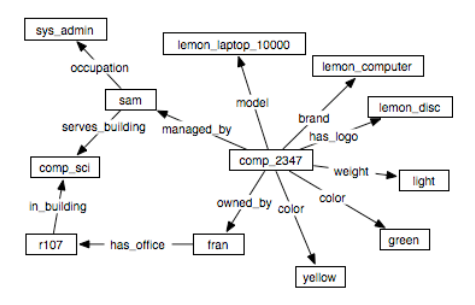
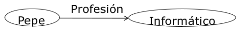
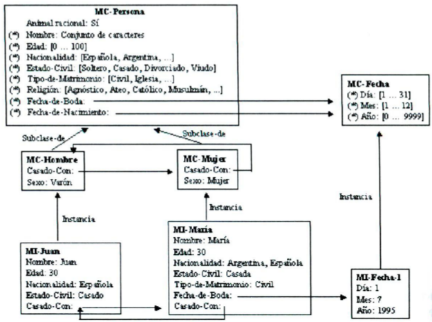
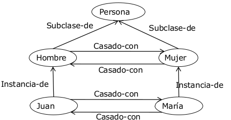

# Representación del conocimiento: métodos estructurados
## Introducción ([PDF](originales/representacion_conocimiento/MetodosEstructurados - Redes Semanticas.pdf))
Los métodos estructurados son una familia de métodos que utilizan grafos para la representación del conocimiento. Se basan en las relaciones entre los elementos de un dominio, y hacen explícita la estructura del dominio.

Son, por tanto, particularmente adecuados para representar conocimiento estructural.

Principalmente, estos métodos son o bien redes semánticas o marcos.

## Evolución
Los sistemas de métodos estructurados iniciales tenían una semántica poco precisa. Se va elaborando la herencia como mecanismo de inferencia, y se van desarrollando sistemas con semántica bien definida.

En la actualidad existen formalismos para representar el conocimiento estructural.

Las tendencias actuales en redes semánticas es la web semántica, y en marcos son las ontologías (con clases, subclases, propiedades y restricciones de las mismas).

## Redes semánticas

Una red semántica es un formalismo gráfico basado en relaciones binarias. Del lenguaje natural ("Pepe es informático"), pasamos a la lógica de primer orden ("PROFESION(Pepe, Informático)") y por último a la red semántica: .

La red semántica nos permite una representación gráfica del formalismo Objeto-Atributo-Valor. Los nodos representan los conceptos o entidades (objetos, valores) y los arcos expresan la relación binaria (atributos).

### Sintaxis
Una red semántica es un grafo formado por nodos etiquetados que representan entidades, conceptos, valores; y por arcos unidireccionales etiquetados que representan las relaciones binarias.

Se puede utilizar cualquier etiqueta para un nodo u arco, existe una falta de estandarización.

Hay dos tipos de arcos. Los **descriptivos** proporcionan propiedades de las entidades, y los **estructurales** proporcionan la estructura de la red.

Los estructurales sí tienen cierto grado de estandarización, y su significado es independiente del dominio concreto. Algunos ejemplos son `subclase-de` para generalización, `instancia-de` para instanciación o `parte-de` para agregación.

Para representar predicados no binarios, es necesario **reificar** el predicado creando una instancia del tipo de predicado correspondiente que esté relacionada con cada uno de sus parámetros. La siguiente imagen muestra la reificación del predicado `COMPRAVENTA(Pepe, Luis, Reloj1, 45, Euros)`.

### Inferencia en redes semánticas
Las redes semánticas proporcionan mecanismos de inferencia asociados a los arcos de la red y a procedimientos que los manipulan. Existen dos tipos de inferencias:

- Equiparación: permite resolver preguntas que se representan como una red semántica. Se crea una subred pregunta, con nodos constantes, nodos variables y arcos etiquetados. Se superpone la subred a la original, y si se consigue una superposición perfecta de los nodos constantes y los arcos, se asigna a los nodos variables los valores encontrados en la red.
- Herencia de propiedades: permite que nodos de la red obtengan las propiedades definidas en otros nodos mediante los arcos `instancia` y `subclase-de`. Para ello se pregunta por un nodo y se busca el arco por el que se pregunte. Si no se encuentra, el motor de inferencia recorre los arcos `instancia` y `subclase-de`. En cada camino, prevalece el nodo más próximo que tenga la propiedad. La herencia evita repetir propiedades en instancias y subclases, gestiona bien las excepciones herendando el valor de la propiedad más cercano, pero no gestiona las contradicciones que pueden encontrarse por caminos distintos.

## Marcos ([PDF](originales/representacion_conocimiento/MetodosEstructurados - Marcos.pdf))
### Introducción

Los marcos son estructuras de datos utilizadas para representar elementos bien conocidos (prototípicos). Para adaptarnos a la situación actual, accedemos a la estructura que más se asemeja y modificamos los detalles necesarios.

Como las redes semánticas, hacen explícitas las relaciones de dominio que proporcionan la estructura de la red, pero a diferencia de estas, los nodos tienen estructura y permiten agrupar las propiedades de los elementos del dominio en una unidad denominada **marco** (_frame_).

La representación es principalmente declarativa, especificando las propiedades de los conceptos o individuos, pero permiten añadir elementos operacionales a propiedades individuales mediante facetas.

El dominio queda estructurado en jeraquías de herencia.

Para la inferencia se usa la equiparación, la herencia y los métodos operacionales.

En la actualidad, los marcos son el principal formalismo de representación del conocimiento cuando éste se organiza en clases o cuando es conocimiento estructural. La organización en jerarquías de clases y la herencia se mantienen en la mayoría de lenguajes de ontologías.

### Elementos de un sistema de marcos
- Marcos: representan clases (hombre, puerta lógica, alarma...) e instancias (Juan, AND-1, alarma incendio 327...).
- Relaciones: representan dependencias entre marcos. Las estándar son:
	- `subclase-de`: Relación binaria entre marcos de clase. Es dirigida, de orden parcial (reflexiva, antisimétrica y transitiva). La inversa de la relación es la superclase. Con esta relación se crea una jerarquía de clases desde las más generales a las más específicas.
	- `instancia-de`: Relación dirigida entre marcos de instancia y de clase. La relación inversa es la representación. También establece jerarquías.
	- Otras relaciones no estándar: Pueden existir relaciones binarias y dirigidas dependientes del dominio (`hermano-de`, `casado-con`...). Se han de definir primero entre marcos de clase.

- Propiedades: describen los marcos de clase o de instancia. Las propiedades de clase reciben el valor en la clase que las define y son comunes a todas las instancias salvo excepciones. Las propiedades de instancia describen las propiedades específicas de una instancia. Se definen en los marcos de clase pero toman valor en los de instancia, y normalmente el valor es distinto en cada instancia.
- Facetas: descripción adicional de los valores que pueden tomar las propiedades. Algunas características adicionales que pueden dar las facetas es información sobre el tipo de una propiedad, cardinalidad de las relaciones, o demonios (procedimientos que se invocan automáticamente al acceder o alterar el valor de una propiedad).
