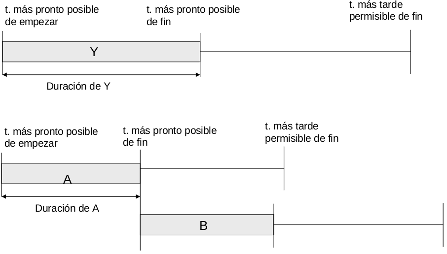

## Ideas sobre PERT y CPM ([PDF](originales/PGP_PERT_CPM_1516.pdf))

- PERT: Program Evaluator and Review Technique.
- CPM: Critical Path Method.

Facilitan la planificación de proyectos en los que estén implicadas muchas actividades. Ambas fuerzan al gestor del proyecto a planificar con un cierto nivel de detalle. CPM añade el tema de gestión de recursos y costes. Ambas técnicas facilitan la respuesta a preguntas como:

- ¿Cuándo finalizará el proyecto?
- ¿Cuáles son las actividades críticas (las que retrasarían el proyecto si alguna de ellas se retrasa)?
- ¿Cuáles son las actividades no críticas (las que se pueden retrasar algo sin que haya incidencia en el proyecto)?
- ¿Cuánto se pueden retrasar las actividades sin retrasar significativamente el proyecto?
- ¿Cómo se pueden concentrar los recursos para acelerar la finalización del proyecto?

Por tanto, permiten:

- detectar cuellos de botella,
- cumplir plazos de entrega con mayor probabilidad,
- evaluar los efectos de los cambios en el desarrollo del proyecto.

### Pasos a realizar

1. Definir el proyecto y todas sus actividades significativas.
2. Determinar las relaciones de precedencia entre dichas actividades.
3. Estimar el tiempo necesario para finalizar cada actividad.
4. Dibujar una red que conecte todas las actividades y las etiquete con las estimaciones de tiempo.
5. Calcular el camino crítico a través de la red.
6. Utilizar la red para planificar, temporizar, monitorizar y controlar el proyecto.

### Ficha de especificación de tarea
Contendrá los siguientes datos:

- Número.
- Nombre.
- Descripción.
- Esfuerzo estimado.
- Personas.
- Recursos.
- Duración.
- Entregables.
- Predecesoras.

### Características de la red:
Los **nodos** representan eventos (comienzo o fin de una o varias actividades). Los **arcos** representan actividades. Un **camino** es una secuencia de actividades conectadas desde el nodo de comienzo hasta el de finalización.

Dos nodos no pueden estar directamente conectados por más de un arco. Cada actividad se representa con un único arco.

Se pueden usar **actividades ficticias** para establecer una relación de precedencia. Es una actividad sin duración. Debe usarse para no violar las propiedades definidas anteriormente.

También se pueden representar las tareas en el nodo (el nodo es un cuadrado) o en la flecha que une los nodos (el nodo es un círculo).

La duración del proyecto será la longitud del camino más largo o **camino crítico**. Las **actividades críticas** son las que forman el camino crítico.

### Tiempo más pronto posible para un evento.
$E_j$ es el instante en el que se producirá el evento (Evento, no tarea) $j$ si todas las actividades precedentes han comenzado tan pronto como sea posible.

- Pasada hacia adelante: Se calcula $E_j$ para cada evento $j$ comenzando en el primer nodo y avanzando hasta el evento final.
- Regla del tiempo más pronto posible: $E_j$ es el **máximo** de las sumas $E_i + t_{ij}$ para cada evento inmediatamente precedente $i$ e interviniendo en la actividad $ij$.

### Tiempo más tarde permisible.
$L_i$ es el tiempo más tarde en el que se puede comenzar el evento $i$ sin que se produzca un retardo en el proyecto.

- Pasada hacia atrás: Se calcula $L_i$ para cada evento $i$ comenzando por el último nodo y moviéndose hacia atrás.
- Regla del tiempo más tarde permisible: $L_i$ es el **mínimo** de las diferencias $L_j - t_{ij}$ entre cada evento inmediatamente siguiente y la actividad $ij$

### Holgura para una actividad
Ventana de tiempo en la que puede comenzar dicha actividad.

$ES$: Tiempo más pronto posible para la actividad. Longitud del recorrido más largo desde el nodo de inicio hasta el comienzo de la actividad.

$LS$: Tiempo más tarde que puede empezar una actividad sin retrasar el proyecto.

Holgura de la actividad $ij = LS - ES = (L_j - t_{ij}) - E_i$.

Una **Actividad crítica** es la que tiene holgura 0. El camino crítico está formado por todas las actividades críticas. Si una actividad crítica se retrasa, se retrasará todo el proyecto.

### Datos usados en PERT y CPM

- Early Start
- Early Finish
- Latest Start
- Latest Finish

La duración representa el tiempo necesario para llevar a cabo la actividad en el momento de planificar o  el tiempo restante cuando se hacen replanificaciones.

### Posibles dependencias entre tareas

- La tarea B no puede empezar hasta que la tarea A termine: Finish-to-start (FS).
- La tarea B no puede empezar hasta que la tarea A empiece: Start-to-start (Ss).
- La tarea B no puede terminar hasta que la tarea B termine: Finish-to-finish (FF).
- La tarea B no puede terminar hasta que la tarea A termine: Start-to-finish (SF).

### Ventajas de PERT

- Fuerza a gestionar el plan.
- Permite observar las interrelaciones entre actividades e identifica el camino crítico.
- Expone el paralelismo que se puede dar en las actividades, lo que ayuda a la hora de exponer recursos.
- Permite la planificación temporal y simulación de planificaciones alternativas.
- Permite al gestor del proyecto realizar el seguimiento y control del mismo.

## Holguras en CPM y PERT ([PDF](originales/tema_2/float_CPM_nuevo.pdf))
Tanto PERT como CPM son métodos que incorporan incertidumbre en la gestión de proyectos y dan las probabilidades de finalizar las etapas del proyecto en tiempos límite especificados y una estimación de la finalización del proyecto.

Sin embargo, CPM no incorpora incertidumbre en los tiempos de las tareas, y en su lugar supone que los tiempos de las actividades son propocionales a los recursos reservados para ellas, y que cambiando los recursos asignados cambia la duración de las tareas; lo que requiere más experiencia sobre la relación entre los recursos y tiempos.

### Holguras en CPM
En CPM las holguras se llaman **flotantes** (float) e indican el grado de libertad de la planificación bajo una variedad de condiciones, por ejemplo la disponibilidad de los recursos. Hay cuatro holguras:

1. Holgura total.
2. Holgura libre.
3. Holgura independiente.
4. Holgura de seguridad o programada.

Para definir estas holguras, usamos las siguientes definiciones:

- Tiempo más pronto posible ($ES_{ij}$) de una actividad: instante más pronto posible que puede comenzar dicha actividad suponiendo que todas las anteriores han finalizado lo más pronto posible.
- Tiempo más tarde permisible ($LF{ij}$) de una actividad: instante más tarde que puede finalizar una actividad sin retrasar el tiempo de finalización de todo el proyecto.

También hay otras dos definiciones para el tiempo más pronto posible de finalización ($EF_{ij}$) o más tarde permisible de comienzo ($LS_{ij}$)

El **tiempo flotante total** coincide con la holgura en PERT y es el tiempo que una actividad puede retrasarse sin que dicho retraso afecte a la duración total del proyecto. Se puede obtener de dos formas:

- $Ft_{ij} = LS_{ij} - ES_{ij}$
- $Ft_{ij} = LF_{ij} - EF_{ij}$

